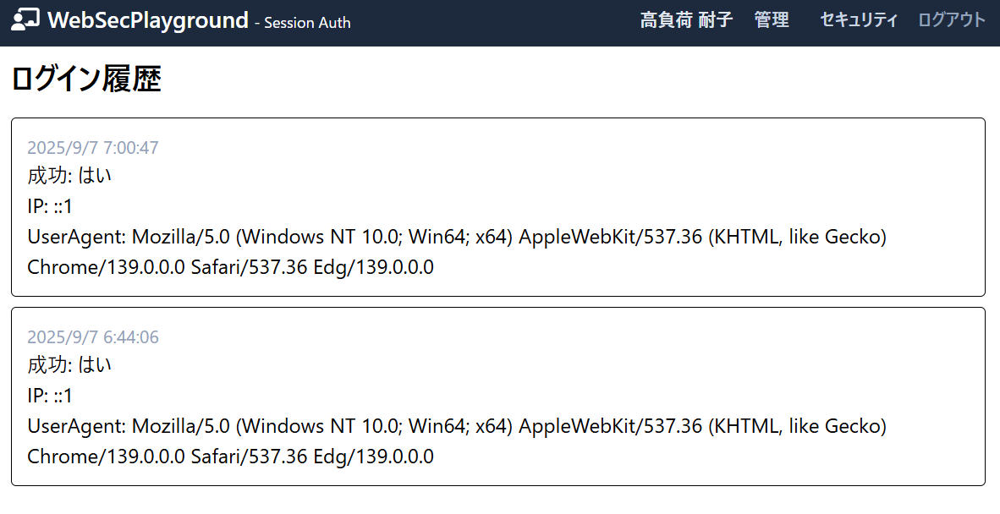

````markdown
---

# web-sec-auth (Next.js / セッションベース認証)

## 0) 冒頭のTL;DR（評価者のための最短ナビ）

**TL;DR**
- 認証方式: セッションベース (Credentials + HttpOnly Cookie)
- 追加機能: (1) 連続N回失敗でアカウントロック、(2) パスワード強度メーター、(3) ログイン履歴
- まずは「評価者向けナビ」を見て、スクショと該当ファイルを確認してください。

---

## 1) 評価者向けナビ（スクショ/実装位置）

1. サインアップ画面（パスワード強度メーター表示）
  - 画像: 
   - 実装: `src/app/signup/page.tsx`, `src/app/_components/PasswordStrength.tsx`
   - 確認事項: 入力に応じた強度スコア、一定未満で登録ボタン無効化

2. ログイン失敗 → 連続N回でロック
  - 画像: 
   - 実装: `src/app/api/login/route.ts`, `prisma/schema.prisma` の `isLocked` / `failedCount`
   - 確認事項: 失敗で `failedCount` が増え、閾値到達で `isLocked=true`

3. 管理者ページ（ロックユーザ一覧 / ロック解除）
  - 画像: 
   - 実装: `src/app/api/admin/users/route.ts`, `src/app/admin/users/page.tsx`
   - 確認事項: admin 権限でロック済みユーザ一覧と解除ボタンが動作する


---

## 2) 概要

- Next.js (App Router) を用いたセッションベース認証。
- 主な特徴:
  - セッションを DB に保存、HttpOnly Cookie(`session_id`)で管理
  - bcrypt によるパスワードハッシュ化
  - 連続失敗によるアカウントロック
  - ログイン履歴の記録と閲覧
  - パスワード強度メーター

---

## 3) セキュリティ実装サマリ

- パスワードハッシュ: `bcryptjs`（推奨 cost=12）
- セッション: DB 保存 + HttpOnly Cookie、`SameSite=Strict`、本番で `secure=true`
- ロック/レート制御: `failedCount` と `isLocked` に基づくシンプルなロック実装
- ログ: `LoginHistory` テーブルに IP/UA/成功フラグを保存
- 不要機能の削除: 未使用のニュース/ショップ/JWT 関連コードは削除済

---

## 4) アクセス制御表（RBAC）

| パス | 説明 | user | admin | 未ログイン |
|---|---|:--:|:--:|:--:|
| `/` | ホーム | ✅ | ✅ | ✅ |
| `/signup` | 会員登録 | ✅ | ✅ | ✅ |
| `/login` | ログイン | ✅ | ✅ | ✅ |
| `/dashboard` | 会員専用ページ | ✅ | ✅ | ❌ |
| `/me/security` | セキュリティ履歴（個人のログ） | ✅ | ✅ | ❌ |
| `/admin` | 管理ページ（ユーザ管理） | ❌ | ✅ | ❌ |

> 注: `✅` はアクセス可能、`❌` はアクセス不可を示します。

---

## 5) 仕様 → 実装 → 確認方法（エビデンス対応表）

| 項目 | 仕様 / 要件 | 実装ファイル（主な場所） | 確認画像 |
|---|---|---|:--:|
| セッション認証 | サーバ側セッション + Cookie（HttpOnly, SameSite） | `src/app/api/_helper/createSession.ts`<br>`src/app/api/_helper/verifySession.ts` |  |
| パスワードハッシュ | bcrypt による保存・比較（シード / サインアップ / ログイン） | `prisma/seed.ts`<br>`src/app/_actions/signup.ts`<br>`src/app/api/login/route.ts` | （スクリーンショット参照） |
| Cookie 属性 | HttpOnly / SameSite=Strict / Secure (prod) | `src/app/api/_helper/createSession.ts` |  |
| ロック実装 | `failedCount` インクリメント → 閾値で `isLocked=true` | `src/app/api/login/route.ts`<br>`prisma/schema.prisma` (`User.isLocked`, `User.failedCount`) | （スクリーンショット参照） |
| ログイン履歴 | IP / UA / 成功フラグを `LoginHistory` に記録、閲覧可能 | `src/app/api/me/security/route.ts`<br>`src/app/me/security/page.tsx` |  |

---

## 6) ディレクトリ構成（抜粋）

```
src/
  app/
    api/
      login/route.ts
      me/security/route.ts
      admin/users/route.ts
      admin/users/unlock/route.ts
      _helper/
        createSession.ts
        verifySession.ts
    signup/page.tsx
    login/page.tsx
    me/security/page.tsx
    admin/users/page.tsx
  _components/
  _actions/
prisma/
  schema.prisma
prisma/seed.ts
scripts/capture-screenshots.js
docs/images/*.png
```

---

## 7) データモデル（要点）

- `User`: `email(unique)`, `passwordHash`, `role`, `isLocked`, `failedCount`, `lastLoginAt`
- `Session`: `id`, `userId`, `expires`, `data`
- `LoginHistory`: `id`, `userId`, `ip`, `userAgent`, `success`, `createdAt`

---

## 8) 認証フロー（要約）

1. `/login` で email/password を送る
2. サーバは `isLocked` をチェック → ロック中は拒否
3. `bcrypt.compare` 成功 → `failedCount` を 0 にリセット、セッション発行
4. 失敗 → `failedCount++`、閾値超過で `isLocked=true`
5. 管理者は `/admin/users` でロック解除可能

---

## 9) 検証手順（起動しない評価者向け）

- 画像1 (signup_strength.png): サインアップで強度が低いと登録ボタンが無効になる
- 画像2 (lockout_flow.png): ログインをN回失敗するとアカウントがロックされる
- 画像3 (forbidden_admin.png): admin ではないと `/admin` にアクセスできない
- 画像4 (me_security.png): `/me/security` で過去ログイン履歴が見られる

---


## 10) 付録：ローカルでの実行手順（参考）

```bash
npm install
npx prisma db push
npx prisma generate
npx prisma db seed
npm run dev


---


